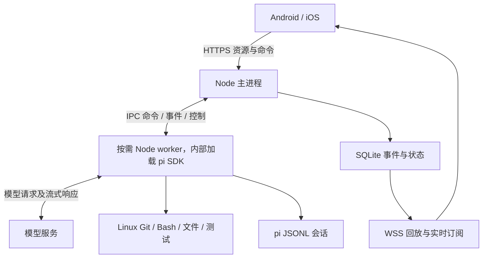

# V1 产品与架构设计

状态：待实现的规范。2026-09-12。已确认目标为统一 Linux 执行环境，默认使用 Docker Compose。本文替代此前以开发电脑原生运行为默认的草案。

接口与事件以 [protocol-v1.md](protocol-v1.md) 为准，存储以 [data-model.md](data-model.md) 为准，开发顺序以 [development-plan.md](development-plan.md) 为准。

## 1. 产品目标与边界

用户离开电脑后，在 Android / iOS 上找到项目与 Session，继续编程对话，看见 SDK 实际提供的执行过程，并及时干预。手机连接断开不结束任务；后端重启后恢复历史并准确标记中断。

首版是自托管单 owner 实例，允许配对多个设备。数据保留 user_id，公开多租户执行属于后续设计。公开仓库不意味着服务匿名可用。

| ID | 必须交付的能力 |
| --- | --- |
| FR01 | 设备配对、鉴权、吊销，HTTPS / WSS 接入 |
| FR02 | 注册 Linux 已有项目目录，项目与 Session 列表、活动与状态 |
| FR03 | 新建、改名、归档、取消归档及恢复旧 Session |
| FR04 | 文本对话、停止、steer、follow-up |
| FR05 | 回复 / thinking 内容块、工具参数、累计输出、结果及异常 |
| FR06 | 模型选择及对应思考等级，配置按 Session 生效 |
| FR07 | 手动上下文压缩、取消、自动压缩与重试状态 |
| FR08 | select / confirm / input / editor 交互请求及手机响应 |
| FR09 | 持久事件、快照、历史分页、锁屏和弱网重连 |
| FR10 | 工作区串行、worker 容量限制、命令幂等和崩溃恢复 |
| FR11 | Linux Docker 部署、状态持久化、权限、停止与备份恢复 |
| FR12 | Android / iOS 实际设备的完整使用闭环 |

Session 不设固定业务角色。开发、审核、分析等只作为标题；首版不实现基于角色的工作流或权限。项目关联真实代码目录，多个 Session 拥有独立上下文，但共享项目文件。

不包含：多机 runner、Matrix、PG / Redis、自动 worktree、agent 编排、系统推送、文件编辑器、任意全屏 TUI、自助注册、计费及公开多租户沙箱。V1 对话输入为文本，图片附件后续增加。

## 2. 技术基线

| 层 | 决策 |
| --- | --- |
| Monorepo | pnpm 10，TypeScript；实际版本在 S01 锁定 |
| Backend | Node.js 24 LTS、Fastify 5、Zod 公共契约；SDK 支持 Node >=22.19 |
| Agent | `@earendil-works/pi-coding-agent@0.85.1`，只由 agent-pi 包依赖 |
| Storage | SQLite >=3.38，better-sqlite3，WAL、外键、短事务、版本化迁移 |
| Mobile | React Native + Expo；S01 选择互相兼容的稳定版本并锁定 |
| Tests | Vitest / 服务集成测试、合成事件、真实 SDK smoke、Maestro 设备流程 |
| Deployment | Linux、Docker Compose，一个 app 容器；可加 Caddy TLS 入口 |

HTTP 用于资源与命令，WebSocket 用于订阅控制及过程事件。SSE 也可实现需求，但 V1 不同时维护第二套传输。Matrix 的房间、联邦和同步不能替代任务执行语义，本版不采用。

## 3. 运行模型



主进程与 workers 位于同一个 app 容器，项目挂载到 `/workspaces`，状态挂载到 `/state`。各 worker 的 cwd 是其项目目录。SDK 是库，`prompt()` 是方法调用，`subscribe()` 是回调，主服务无需连接一个额外的 pi 网络服务器。

| 对象 | 生命周期 |
| --- | --- |
| 主进程 | 容器启动后常驻，处理 API、鉴权、调度、SQLite 和 WSS |
| worker | 需要执行或修改 SDK 状态时加载；默认最多 4 个已加载 worker，空闲 5 分钟可回收 |
| AgentSession | 位于 worker 内存；从指定文件创建 / 恢复，不随手机页面切换重建 |
| 手机连接 | 前台连接，后台可能被操作系统挂起；不负责 worker 保活 |
| 持久 Session | worker 不存在时依然保留，浏览历史不触发模型请求 |

第一版最多同时执行 2 个 Run，可配置；容量满时排队。100 个历史 Session 不代表 100 个进程。空闲进程不持续请求模型。

主进程对每次加载分配不可复用的 workerEpoch。所有 IPC 消息携带 sessionId、workerEpoch、commandId / runId；旧 epoch 的迟到事件不应用于新运行。内部通信与外部协议有独立类型。

### 一次对话

1. 手机提交带幂等键的命令。服务端校验归属、状态与 payload，事务保存命令、Run 和事件，返回 202。
2. 调度器获得 session 操作权、工作区运行权和 worker 容量；记录 dispatching，再向 worker 发出命令。
3. worker 恢复指定 pi 文件，订阅事件并绑定 UI 后调用 prompt；区分 SDK preflight 接受和完成。
4. worker 按序上报规范化事件，主进程合并相邻小增量，提交事件及投影后才广播。
5. 手机断网时执行及记录继续。运行真正结束后释放工作区与执行容量，worker 可暂留。

SDK 回调与 SQLite 提交不构成跨进程事务。未收到主进程持久化 ACK 的内部批次可重发，按 `(workerEpoch, batchNo)` 去重；ACK 之前崩溃的未提交尾部可能丢失，显示中断，不伪造过程。

## 4. 用户操作

项目页按最近活动排序，会话列表显示标题、最近消息、状态与更新时间。详情页显示模型、有效思考等级、运行阶段，以及统一时间线。

按钮和 `/` 命令面板生成相同结构化请求。下面的命令名称属于本应用，不承诺与 pi TUI 的全部命令同名。

| 操作 | 实现语义 |
| --- | --- |
| `/new` | 当前项目创建独立 Session，旧会话不清空；第一次加载时创建新的 pi JSONL |
| `/rename` | 修改数据库标题；通过版本号单向同步 pi 显示名，未加载时下次同步 |
| `/archive` | 仅无活动、排队命令或待答交互时可归档；不删除文件或历史 |
| `/unarchive` | 恢复列表可见性，继续原上下文 |
| `/model` | 空闲时选择已配置鉴权的模型；不持久化为 pi 全局默认 |
| `/thinking` | 选项由当前模型支持能力决定；返回 SDK 实际生效等级 |
| `/compact` | 空闲时创建 compact Run；完成后保留原消息供历史查看 |
| `/stop` | 明确指定当前 runId，取消执行 / 压缩；等待停止结果，不回滚文件 |
| 补充当前任务 | steer，指定当前 runId；在 SDK 允许的工具调用边界生效 |
| 结束后处理 | follow_up，持久化为后续 Run，由应用队列在前一 Run 完成后调用 prompt |

普通 prompt 在同 Session 已有 Run 或队列时返回冲突，由用户明确选择 follow-up。steer、abort、respond 走控制通道，不等待长 prompt 的 Promise 完成。

配置变更仅在 Session 无活动或排队操作时接受，并在 session mutex 内完成检查与预留。新 Session 使用项目默认配置，未配置时用后端默认；配置只影响当前 Session。压缩通常调用模型生成摘要，有延迟及模型用量。

### 时间线

- 文本和 thinking 由有序内容块组成；只展示 provider 经 SDK 实际提供的内容，允许摘要、隐藏或不支持。
- 工具按 toolCallId 关联，展示参数、累计输出、耗时及结果。累计快照使用替换，不反复追加。
- message 完成不等于 Run 完成。工具调用、自动压缩和重试期间仍保持真实运行状态。
- 长输出显示尾部及截断标记，完整已保留内容通过授权 artifact 访问；不承诺 SDK 未保留的内容存在。
- 阅读历史时不强制滚动，显示新内容提示。断网提示与 agent 状态分别展示。
- 交互请求支持选择、确认、单行与多行输入。无手机在线时仍保存 pending；重连继续显示。

## 5. 状态与并发

Run 状态：queued → running ↔ waiting_input → completed / failed / aborted / interrupted；尚未开始的 Run 可 cancelled。phase 表示 thinking、tool、compacting、retrying 或 stopping 等，不能仅凭 phase 推断完成。

Command 状态：queued → dispatching → accepted → completed / failed / cancelled / unknown。dispatching / accepted 不明结果在恢复时标记 unknown，不能直接重新执行。

Session 列表状态由活动 Run、队列和交互推导；配置操作期间也显示 busy。归档和设备离线不是 Run 状态。

### 工作区运行权

项目路径在 Linux runner 内 realpath，并校验允许根目录与文件可读写。拒绝已注册目录的重复与祖先 / 后代重叠；符号链接解析后再比较。根目录的 device / inode 用于发现同机挂载别名。

每个项目的 workspaceKey 默认是规范路径。Git 项目还解析真实的 git common directory；共享 Git 元数据的 worktree 使用同一调度键，V1 保守串行。Session 继承项目目录，V1 不支持单独切换目录。

同 workspaceKey 只允许一个 Run，包含手动 compact。不同工作区在容量内可并行。队列按进入顺序公平调度，follow-up 不能永久占有目录。锁只协调本应用；容器外的文件修改不受其保护。

## 6. 恢复保证

| 故障 | 必须行为 |
| --- | --- |
| 手机断网 / 锁屏 | 执行继续；按事件 seq 重连，重复事件只应用一次 |
| HTTP 响应丢失 | 原幂等键返回原命令与响应，不生成第二次执行 |
| worker 崩溃 | Run interrupted，记录已知结果；清理确认后才释放工作区 |
| 主进程 / 容器重启 | 排队且确定未分派的工作可继续；已分派但不明结果不自动重发 |
| 旧 worker 迟到消息 | epoch 不匹配，拒绝写入新状态 |
| 工具进程未确认结束 | 阻塞工作区，提示重启干净的 app 容器；不启动第二个 writer |
| 模型重试 / 自动压缩 | 继续记录相应阶段，不因早期 agent_end 错报完成 |
| 等待输入时断网 | pending 保留；回答按 interactionId 和 epoch 校验 |
| 等待输入时后端重启 | 回调失效，Interaction cancelled，Run interrupted；旧回答不接受 |

单主服务启动时持有 `/state/instance.lock` 的排他系统锁，拒绝第二个主实例。容器 init、信号处理、worker 心跳和进程组负责常规子进程清理；无法证明清理完成时阻塞，不猜测。V1 不支持脱离受管理进程树的 daemonizing 命令。

pi JSONL 与业务数据库分别持久化。恢复模型上下文使用 pi 文件，客户端回放使用数据库；重启时读取 pi 实际模型、思考等级及 entry 关联校准业务快照。不能将客户端事件重新拼成模型历史。

不承诺 shell 副作用恰好一次、不承诺中途 shell 原地续跑、不承诺恢复尚未提交的输出。用户决定如何处理 interrupted / unknown 的任务。

## 7. SDK 接入注意事项

已按 0.85.1 的 npm gitHead `d981de1229ef899957bbe968bc8dcda02a21f477` 核对；仍必须通过 S02 的真实运行验证。

| 能力 | SDK 接入点 |
| --- | --- |
| 创建 / 恢复 | createAgentSession、SessionManager.create / open；显式 cwd、agentDir 和会话文件 |
| 模型 | ModelRuntime、setModel；provider 凭据仅留在后端 |
| 等级 | getAvailableThinkingLevels、setThinkingLevel；不使用 persist:true 修改全局默认 |
| 流式 | subscribe、message_update、thinking_delta、工具生命周期事件 |
| 控制 | prompt、steer、abort；应用管理 follow-up 队列 |
| 压缩 | compact、abortCompaction；compact 会先 abort，必须应用层先核实空闲 |
| 显示名 | setSessionName；应用标题是来源，pi 名称是镜像 |
| 扩展交互 | bindExtensions(uiContext 等)，select / confirm / input / editor 映射到手机 |
| 完成 | agent_settled、prompt / compact Promise、最终 stopReason 与重试状态综合判断 |

SDK 的 prompt preflight 接受、HTTP 命令接收、完整执行结束是不同边界。SDK / provider 的最终消息与工具结果校准显示。SDK 与 CLI RPC JSON 的类型不同，不能直接混用。

资源加载应只包含运营者配置的可信资源及应用的交互适配扩展。项目扩展自动加载默认关闭；S02 验证固定 SDK 的 loader / trust 行为后，用明确配置启用可信项目扩展。它们拥有容器用户权限，任意 TUI 自定义组件不在兼容承诺内。

## 8. 模块与扩展边界

```text
apps/server/        API、数据库、队列、worker 管理、WSS
apps/mobile/        Expo 页面、缓存、连接与时间线
packages/protocol/  DTO、schema、reducer，无 pi 类型依赖
packages/agent-pi/  SDK 适配、生命周期、IPC、UI 桥接
tests/              协议、故障、SDK、设备和部署验收
deploy/             Docker、Compose、TLS 示例
docs/               设计、计划与证据
```

后续 Web 客户端复用协议，其他 agent 实现同一内部接口，多机再引入 runner 路由，自动 worktree 再引入 workspace 生命周期。V1 不提前实现这些模块。

## 9. 依据

- [pi SDK](https://github.com/earendil-works/pi/blob/d981de1229ef899957bbe968bc8dcda02a21f477/packages/coding-agent/docs/sdk.md)
- [AgentSession 实现](https://github.com/earendil-works/pi/blob/d981de1229ef899957bbe968bc8dcda02a21f477/packages/coding-agent/src/core/agent-session.ts)
- [pi 压缩机制](https://github.com/earendil-works/pi/blob/d981de1229ef899957bbe968bc8dcda02a21f477/packages/coding-agent/docs/compaction.md)
- [pi session 格式](https://github.com/earendil-works/pi/blob/d981de1229ef899957bbe968bc8dcda02a21f477/packages/coding-agent/docs/session-format.md)
- [npm 0.85.1 元数据](https://registry.npmjs.org/@earendil-works%2Fpi-coding-agent/0.85.1)
- [SQLite WAL](https://sqlite.org/wal.html)
- [Docker bind mounts](https://docs.docker.com/engine/storage/bind-mounts/)
