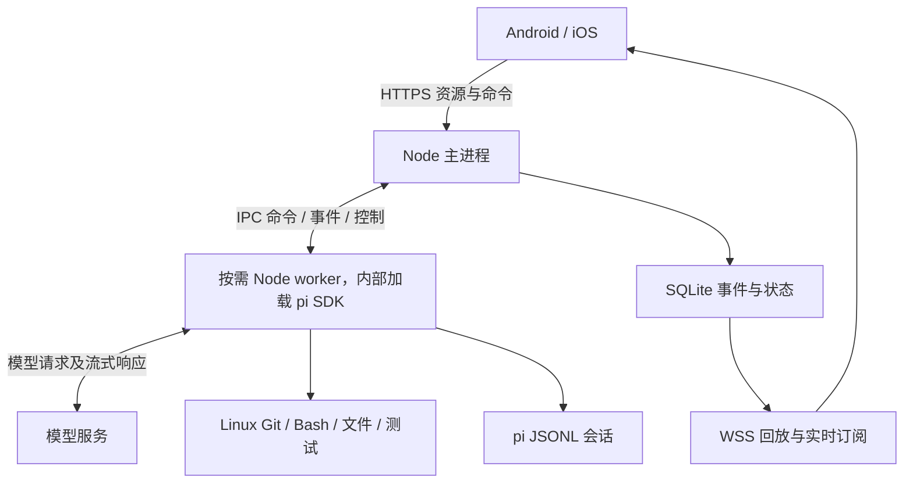

# V1 产品与架构设计

状态：待实现的规范。2026-09-12。已确认目标为统一 Linux 执行环境，默认使用 Docker Compose。本文替代此前以开发电脑原生运行为默认的草案。

接口与事件以 [protocol-v1.md](protocol-v1.md) 为准，存储以 [data-model.md](data-model.md) 为准，开发顺序以 [development-plan.md](development-plan.md) 为准。[整体 TUI 体验原则](tui-experience.md)适用于所有 pi 能力，[Bash 对照](bash-compatibility.md)是其中一部分。

## 1. 产品目标与边界

用户离开电脑后，在 Android / iOS 上找到项目与 Session，继续编程对话，看见 SDK 实际提供的执行过程，并及时干预。手机连接断开不结束任务；后端重启后恢复历史并准确标记中断。

首版是自托管单 owner 实例，允许配对多个设备。数据保留 user_id，公开多租户执行属于后续设计。公开仓库不意味着服务匿名可用。

| ID | 必须交付的能力 |
| --- | --- |
| FR01 | 设备配对、鉴权、吊销，HTTPS / WSS 接入 |
| FR02 | 注册 Linux 已有项目目录，项目与 Session 列表、活动与状态 |
| FR03 | 新建、改名、归档、取消归档及恢复旧 Session |
| FR04 | 文本对话、停止、steer、follow-up |
| FR05 | 回复 / thinking 内容块、工具参数、累计输出、结果及异常 |
| FR06 | 模型选择及对应思考等级，配置按 Session 生效 |
| FR07 | 手动上下文压缩、取消、自动压缩与重试状态 |
| FR08 | 执行、初始化、配置及扩展回调中的 select / confirm / input / editor 请求、手机回答和重连恢复 |
| FR09 | 持久事件、快照、历史分页、锁屏和弱网重连 |
| FR10 | 多 Session 并发、可配置资源策略、命令幂等和准确的崩溃恢复 |
| FR11 | Linux Docker 部署、状态持久化、权限、停止与备份恢复 |
| FR12 | Android / iOS 实际设备的完整使用闭环 |
| FR13 | 原生 Bash 与本地 pi TUI 对齐：命令、开发工具、网络、超时、后台服务及模型可见的工具结果 |
| FR14 | 整体以 pi TUI 为兼容基线，原生资源、控制、会话和交互默认保留，额外限制须有实际问题或用户配置依据 |

Session 不设固定业务角色。开发、审核、分析等只作为标题；首版不实现基于角色的工作流或权限。项目关联真实代码目录，多个 Session 拥有独立上下文，但共享项目文件。

后续产品扩展包括多机 runner、Matrix、PG / Redis、自动 worktree、agent 编排、系统推送、自助注册、计费及公开多租户沙箱。原生附件、会话树、扩展命令和 UI 按 S02 的能力清单逐项适配；初始页面的实现顺序不构成后端能力白名单，不能因缺少某种终端组件就关闭整个扩展。

项目会话列表提供“找回历史会话”：读取服务管理目录中此项目尚未映射的有效历史，用户选择后确认认领并打开。不会自动恢复 unknown 命令；继续对话时沿用原生上下文。当前手机时间线不回填旧 JSONL 内容，界面明确说明此限制。该入口不替代原生 switch/fork 的通用能力，也不扩大 agent 执行边界；详情见协议中的 recoverable-history / history-imports。

## 2. 技术基线

| 层 | 决策 |
| --- | --- |
| Monorepo | pnpm 10，TypeScript；实际版本在 S01 锁定 |
| Backend | Node.js 24 LTS、Fastify 5、Zod 公共契约；SDK 支持 Node >=22.19 |
| Agent | `@earendil-works/pi-coding-agent@0.85.1`，只由 agent-pi 包依赖 |
| Storage | SQLite >=3.38，better-sqlite3，WAL、外键、短事务、版本化迁移 |
| Mobile | React Native + Expo；S01 选择互相兼容的稳定版本并锁定 |
| Tests | Vitest / 服务集成测试、合成事件、真实 SDK smoke、Maestro 设备流程 |
| Deployment | Linux、Docker Compose，一个 app 容器；可加 Caddy TLS 入口 |

HTTP 用于资源与命令，WebSocket 用于订阅控制及过程事件。SSE 也可实现需求，但 V1 不同时维护第二套传输。Matrix 的房间、联邦和同步不能替代任务执行语义，本版不采用。

## 3. 运行模型



主进程与 workers 位于同一个 app 容器，项目挂载到 `/workspaces`，状态挂载到 `/state`。各 worker 的 cwd 是其项目目录。SDK 是库，`prompt()` 是方法调用，`subscribe()` 是回调，主服务无需连接一个额外的 pi 网络服务器。

worker 使用原生 Bash 工具和本地执行器，应用只转换展示事件，不对命令加过滤、确认、默认超时或额外文件沙箱。依赖安装、Git、网络、管道、脚本、长运行和后台服务均按同一 Linux 环境中的 pi TUI 语义执行。工具返回给模型的内容不受手机传输 / 显示配额影响。

| 对象 | 生命周期 |
| --- | --- |
| 主进程 | 容器启动后常驻，处理 API、鉴权、调度、SQLite 和 WSS |
| worker | 按需加载后默认驻留至显式关闭或服务退出；容量 / 空闲回收可配置，不能影响活动调用、表单或已启动服务 |
| AgentSession | 位于 worker 内存；按持久状态创建空会话或从校验后的指定文件恢复，不随手机页面切换重建 |
| 手机连接 | 前台连接，后台可能被操作系统挂起；不负责 worker 保活 |
| 持久 Session | worker 不存在时依然保留，浏览历史不触发模型请求 |

默认不额外设置 Run / worker 数量上限或自动回收计时；运营者可按实际资源配置。100 个只浏览历史的 Session 不加载 100 个 worker；空闲进程不持续请求模型。保持已加载状态有助于保留扩展的内存状态及连续使用体验。

主进程对每次加载分配不可复用的 workerEpoch。所有 IPC 消息携带 sessionId、workerEpoch，SDK 操作附 operationId 及可空 commandId / runId；旧 epoch 的迟到事件不应用于新运行。内部通信与外部协议有独立类型。

### 一次对话

1. 手机提交带幂等键的命令。服务端校验归属、状态与 payload，事务保存命令、Run 和事件，返回 202。
2. 调度器根据 SDK 的 Session 状态和运营者配置接受执行；记录 dispatching，再向 worker 发命令。不同 Session 默认可以并发，即使属于同一项目。
3. worker 按持久状态初始化，首次分配的 SDK ID / 路径先获数据库 ACK，再订阅、绑定 UI 并调用 prompt；区分路径已分配、文件已落盘、SDK preflight 接受和完成。
4. worker 按序上报规范化事件，主进程合并相邻小增量，提交事件及投影后才广播。
5. 手机断网时执行及记录继续。运行真正结束后释放已占执行容量及可选工作区锁，worker 默认驻留。

运行结束以 SDK 调用和 agent settle 为依据，不等待所有后台进程退出。已正常返回的 Bash 可以留下开发服务器；后续 Run 继续访问它。单条工具失败仍由 pi 读取结果并修复，不由应用提前终止整个任务。

SDK 回调与 SQLite 提交不构成跨进程事务。未收到主进程持久化 ACK 的内部批次可重发，按 `(workerEpoch, batchNo)` 去重；ACK 之前崩溃的未提交尾部可能丢失，显示中断，不伪造过程。

## 4. 用户操作

项目页按最近活动排序，会话列表显示标题、最近消息、状态与更新时间。详情页显示模型、有效思考等级、运行阶段，以及统一时间线。

按钮和 `/` 命令面板生成相同结构化请求。下面的命令名称属于本应用，不承诺与 pi TUI 的全部命令同名。

| 操作 | 实现语义 |
| --- | --- |
| `/new` | 当前项目创建独立 Session，旧会话不清空；第一次加载分配 SDK ID / 路径，通常第一条 assistant 消息时才写 JSONL |
| `/rename` | 保存版本化标题并同步 pi；原生扩展改名也回写 SQLite，识别应用写入回声，重启恢复待同步意图 |
| `/archive` | 只改变列表可见性，不删除历史、不停止活动任务、不中止表单，也不拒绝原会话的操作 |
| `/unarchive` | 恢复列表可见性，继续原上下文 |
| `/model` | 按 SDK 行为切换已配置模型，支持原生允许的运行中切换；默认作用于当前 Session，可明确选择保存默认值 |
| `/thinking` | 选项由当前模型支持能力决定；返回 SDK 实际生效等级 |
| `/compact` | 按 SDK 原生语义先停止当前运行再压缩；界面展示该行为，保留原消息供历史查看 |
| `/stop` | 指定当前 runId；按 TUI 清取未消费 SDK 输入为可恢复草稿，再取消执行 / 压缩；等待实际结果，不自动重发草稿 |
| `!` / `!!` | 用户 Bash 独立执行，分别纳入 / 排除模型上下文；使用 Bash Operation 记录。停止用户 Bash 使用原生 Session 级 abortBash |
| 补充当前任务 | steer，指定当前 runId；在 SDK 允许的工具调用边界生效 |
| 结束后处理 | follow_up，持久化为后续 Run；前一 Run 正常完成才自动调用 prompt，异常终态暂停队列 |
| 恢复队列 / 取消待执行项 | 查看暂停原因后用 queueVersion 与暂停 runId 明确恢复；可先逐项取消已不适用的 follow-up |

普通 prompt 在运行中按输入区的 steer / follow-up 选择处理；SDK 支持的扩展 slash 命令即时执行，不被应用 busy 检查挡住。steer、abort、respond、模型及等级切换走控制通道，不等待长 prompt 的 Promise 完成。

配置变更按 SDK 实际前置条件执行，短操作锁只保护请求幂等、版本及配置提交，不跨模型执行或等待手机。新 Session 采用用户的项目 / pi 配置；返回实际生效配置，不假设当前流式请求会被追溯改写。压缩沿用原生停止与摘要流程。

stop 与 compact 的队列行为分别按原生路径对照；compact 不自动套用 stop 的 clearQueue。setThinkingLevel 返回后异步 hook 仍可等待表单，setModel 的 hook 错误须订阅 runner 错误通道，不只依赖 Promise catch。详见[原生运行契约](native-runtime-contract.md)。

所有幂等请求在短事务内先重查幂等键，再检查具体操作的真实前置条件，保证并发相同请求返回原收据。异常后仅暂停已有后续项的自动执行；仍可新 prompt、改模型 / 等级、回答交互或取消旧项，空队列无需恢复操作。

### 时间线

- 文本和 thinking 由有序内容块组成；只展示 provider 经 SDK 实际提供的内容，允许摘要、隐藏或不支持。
- 工具按 toolCallId 关联，展示参数、累计输出、耗时及结果。累计快照使用替换，不反复追加。
- message 完成不等于 Run 完成。工具调用、自动压缩和重试期间仍保持真实运行状态。
- custom 和用户 Bash 内容由 Operation 承载，runId 可空，保留原生显示 / 上下文语义。延迟交付使用独立子 Operation；无 Run 内容也能流式、封存、重连和分页，不占模型 Run 槽。
- 异常终态把该 Run 的打开内容封存为 partial 历史，保留已收到的片段并停止转圈；没有最终结果的工具显示“结果未知”，不捏造退出码。工作区清理状态独立显示。
- 长输出显示尾部及截断标记，完整已保留内容通过授权 artifact 访问；不承诺 SDK 未保留的内容存在。
- 阅读历史时不强制滚动，显示新内容提示。断网提示与 agent 状态分别展示。
- 执行、初始化、配置和扩展回调的交互都支持选择、确认、单行及多行输入；无手机在线时保留 pending，重连继续显示。operationId 标识发起操作，runId 可以为空；不因生命周期阶段而自动取消。

## 5. 状态与并发

Run 状态：queued → running ↔ waiting_input → completed / failed / aborted / interrupted；尚未开始的 Run 可 cancelled。phase 表示 thinking、tool、compacting、retrying 或 stopping 等，不能仅凭 phase 推断完成。

Command 状态：queued → dispatching → accepted → completed / failed / cancelled / unknown。dispatching / accepted 不明结果在恢复时标记 unknown，不能直接重新执行。

每个 Run 有唯一 operationId、source 和可空因果 commandId。一条扩展命令可触发多个 Run，自主扩展无需伪造手机命令。GET command 返回全部关联 Runs；原生会话替换后的执行归属新 Session，来源 Command 可留在同 owner 的旧 Session，定向控制仍严格绑定实际目标。

Session 列表状态由活动 Run、队列和交互推导；配置操作期间也显示 busy。归档和设备离线不是 Run 状态。

queueState 为 ready / paused，只管理旧后续项。异常终态封存内容、关闭失效交互；有剩余后续项才暂停它们，没有后续项则 ready。取消最后一项清空暂停字段。新 prompt 不自动恢复旧队列，也不被旧队列暂停拒绝；恢复旧项使用 queueVersion 和暂停 runId 防止过期操作。

### 工作区运行权

项目路径在 Linux 中 realpath，校验存在及当前用户权限；重复目录 / 挂载别名归一为同一项目，根目录 device / inode 辅助识别。允许父子目录注册和 monorepo 子项目，不因可能共享文件而一律拒绝。

workspaceKey 记录规范路径及 Git common directory 的关系，供状态展示及显式开启的串行策略使用。默认不同 Session 可在同项目或同一 Git 仓库并行；文件与 Git 协调和多个本地 TUI 相同。项目切换由用户选择对应项目 / Session，扩展及工具的原生 cwd 操作不额外封锁。

单个 AgentSession 的生成、steer、follow-up 按 SDK 调度；应用不能并发调用不支持重入的状态变更，但不能扩大为所有命令都只能空闲执行。可配置工作区串行和实例容量；未配置时不额外限制。后台服务不占 Run 槽，应用不承诺工作区只有一个 OS writer。

## 6. 恢复保证

| 故障 | 必须行为 |
| --- | --- |
| 手机断网 / 锁屏 | 执行继续；按事件 seq 重连，重复事件只应用一次 |
| HTTP 响应丢失 / 并发重复请求 | 原幂等键返回原命令与响应；锁内先查幂等再检查可变状态，不生成第二次执行 |
| 活动 worker 崩溃 | Run interrupted，封存内容，旧未知命令不自动重跑；有后续项则暂停旧项，仍可主动新操作 |
| 主进程 / 容器重启 | 先检查旧 target_run_id，活动输入型 prompt 也属于失效控制，不创建后续 Run；独立未分派执行项才可保留，已分派不明结果不自动重发 |
| 旧 worker 迟到消息 | epoch 不匹配，拒绝写入新状态 |
| 未完成调用的状态无法确认 | 保留 unknown 及诊断，不自动重复旧调用；根据实际残留选择定向停止或运维重启，不永久封锁项目 |
| 模型重试 / 自动压缩 | 继续记录相应阶段，不因早期 agent_end 错报完成 |
| 等待输入时断网 | pending 保留；回答按 interactionId、operationId 和 epoch 校验 |
| 等待输入时后端重启 | 回调失效，Interaction cancelled、Operation interrupted；若关联活动 Run 则该 Run interrupted，旧回答不接受 |
| 空 Session 回收 / 重启 | 按 uninitialized / unflushed 状态重建，重放 SQLite 已确认配置；不是历史丢失 |
| 持久会话文件缺失或损坏 | HISTORY_UNAVAILABLE，拒绝 open 与执行；不让 SDK 静默创建空历史 |

单主服务启动时持有 `/state/instance.lock` 的排他系统锁，拒绝第二个主实例。SDK abort 按原生语义停止当前未完成调用，应用不扩大到清扫历史后台服务。固定 SDK 的 Bash 在 Linux 本身使用 detached 进程组，因此 worker 的 PGID 退出不能证明一个未完成 Bash 已结束；也不能反过来把所有后台 PID 当成故障。

worker / 主进程崩溃时保存实际状态与 executionScopeKey 诊断，不把未知旧命令自动重放。普通启动不需要宿主 helper 登记；后续明确的新请求不被未知旧任务永久封锁。遇到实际残留进程，再按[部署文档](deployment.md)选择定向清理或显式重启；不能通过禁止命令、默认整容器重启或一套提前的清理证明协议规避适配工作。

pi JSONL 与业务数据库分别持久化。Session 显式保存 uninitialized / unflushed / persisted；SDK 路径已分配不代表文件存在。首次落盘前配置以 SQLite 已确认值为准；落盘后恢复模型上下文使用已校验的 pi 文件，客户端回放使用数据库。文件先落盘、数据库标记后写入的窗口通过检查原映射并认领有效文件处理；空文件、残片或身份不符阻断恢复。不能将客户端事件重新拼成模型历史。详细状态机见 [数据模型](data-model.md)。

合法 header-only / 非 assistant JSONL 也可导入及恢复，首次 assistant 的自动落盘时机不是历史有效性的前置条件。原生 new / switch / fork / import 通过 runtime factory / setRebindSession 交接身份、cwd、资源和 UI；fork / import 可能先写出文件，先保存替换意图，取得目标后确认映射再执行后续回调，失败不盲目重做或覆盖源历史。

不承诺 shell 副作用恰好一次、不承诺中途 shell 原地续跑、不承诺恢复尚未提交的输出。用户决定如何处理 interrupted / unknown 的任务。

## 7. SDK 接入注意事项

已按 0.85.1 的 npm gitHead `d981de1229ef899957bbe968bc8dcda02a21f477` 核对；仍必须通过 S02 的真实运行验证。

| 能力 | SDK 接入点 |
| --- | --- |
| 创建 / 恢复 | createAgentSession、SessionManager.create / open；显式 cwd、agentDir 和会话文件；应用先验证持久状态，禁止对缺失持久历史调用 open |
| 模型 | ModelRuntime、setModel；provider 凭据仅留在后端；hook 抛错后也要回传实际配置，不假称回滚 |
| 等级 | getAvailableThinkingLevels、setThinkingLevel，返回 SDK 实际等级；默认当前 Session，明确选择时可 persist |
| 流式 | subscribe、message_update、thinking_delta、工具生命周期事件 |
| Bash | 原生 Bash 工具及默认本地执行器；保留 command / timeout、shell 环境、后台执行和模型工具结果；只旁路转换手机事件 |
| 控制 | prompt、steer、abort；应用管理 follow-up 队列 |
| 压缩 | compact、abortCompaction；沿用 compact 先 abort 的原生行为，正确区分被停止 Run 与压缩 Run |
| 显示名 | setSessionName 与 session_info_changed 双向同步；记录来源、顺序、回声及恢复水位 |
| 扩展交互 | bindExtensions(uiContext 等)；使用 operationId 将全阶段标准表单映射到手机，包括无 Run 的请求 |
| custom UI 文本/按键适配 | 工厂保留在 worker，以独立子 Operation 的画面通知和连续 select/input 表单承载输入、done 与取消；每个实例的 80×24 虚拟 TUI 复用原生 overlay、onHandle、焦点和输入监听路由；画面仅在对应待答控件内展示；不把自定义 UI 与 custom 消息或模型 Run 混淆 |
| header/footer 工厂 | 80 列文本画面分别投影在会话顶部/输入区下方；footer 接收原生 Git 分支、状态及 provider 数据；异步刷新归属源 Session，清除恢复普通布局；编辑器交互另行验收 |
| editor 工厂 | 独立 Operation 的按键表单驱动原生编辑器及补全，保留工厂 getter、光标粘贴和草稿同步；onSubmit 经 SDK prompt / 用户 Bash，后续用户 Run 不绑定安装 Command；终端菜单及完整全局快捷键仍需适配 |
| 完成 | agent_settled、prompt / compact Promise、最终 stopReason 与重试状态综合判断 |

SDK 的 prompt preflight 接受、HTTP 命令接收、完整执行结束是不同边界。SDK / provider 的最终消息与工具结果校准显示。SDK 与 CLI RPC JSON 的类型不同，不能直接混用。

使用 DefaultResourceLoader 的标准发现与原生配置 / 信任流程，加载工具、扩展、skills、templates 和上下文；不再默认关闭项目扩展。S02 核对原生行为并建立能力清单，移动组件缺口按实际需要适配，不据此关闭整个扩展或删掉其工具。

## 8. 模块与扩展边界

```text
apps/server/        API、数据库、队列、worker 管理、WSS
apps/mobile/        Expo 页面、缓存、连接与时间线
packages/protocol/  DTO、schema、reducer，无 pi 类型依赖
packages/agent-pi/  SDK 适配、生命周期、IPC、UI 桥接
tests/              协议、故障、SDK、设备和部署验收
deploy/             Docker、Compose、TLS 示例
docs/               设计、计划与证据
```

后续 Web 客户端复用协议，其他 agent 实现同一内部接口，多机再引入 runner 路由，自动 worktree 再引入 workspace 生命周期。V1 不提前实现这些模块。

## 9. 依据

- [pi SDK](https://github.com/earendil-works/pi/blob/d981de1229ef899957bbe968bc8dcda02a21f477/packages/coding-agent/docs/sdk.md)
- [AgentSession 实现](https://github.com/earendil-works/pi/blob/d981de1229ef899957bbe968bc8dcda02a21f477/packages/coding-agent/src/core/agent-session.ts)
- [SessionManager 首次落盘与打开行为](https://github.com/earendil-works/pi/blob/d981de1229ef899957bbe968bc8dcda02a21f477/packages/coding-agent/src/core/session-manager.ts)
- [Bash 子进程与进程组](https://github.com/earendil-works/pi/blob/d981de1229ef899957bbe968bc8dcda02a21f477/packages/coding-agent/src/core/tools/bash.ts)
- [pi 压缩机制](https://github.com/earendil-works/pi/blob/d981de1229ef899957bbe968bc8dcda02a21f477/packages/coding-agent/docs/compaction.md)
- [pi session 格式](https://github.com/earendil-works/pi/blob/d981de1229ef899957bbe968bc8dcda02a21f477/packages/coding-agent/docs/session-format.md)
- [npm 0.85.1 元数据](https://registry.npmjs.org/@earendil-works%2Fpi-coding-agent/0.85.1)
- [SQLite WAL](https://sqlite.org/wal.html)
- [Docker bind mounts](https://docs.docker.com/engine/storage/bind-mounts/)
